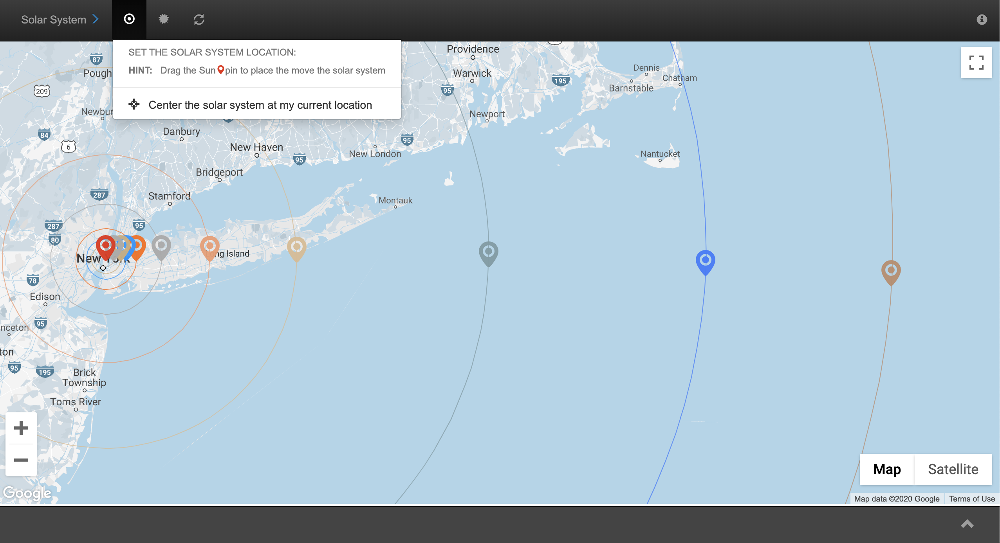
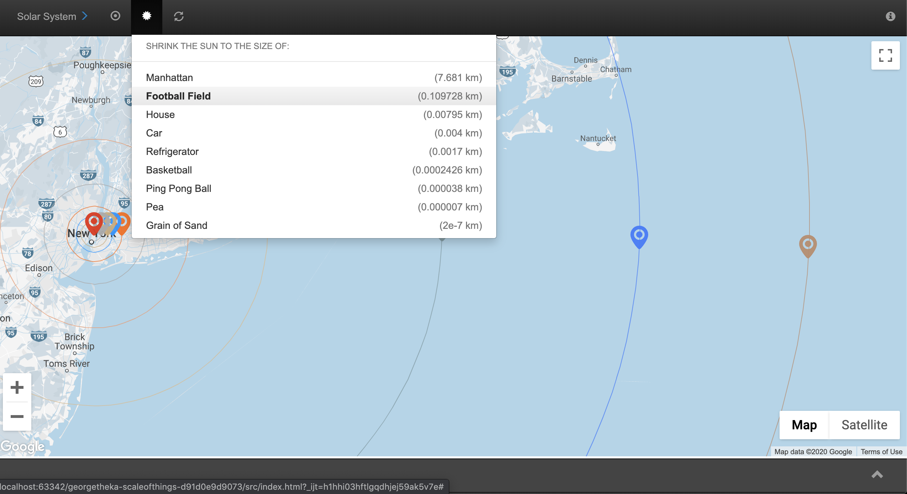
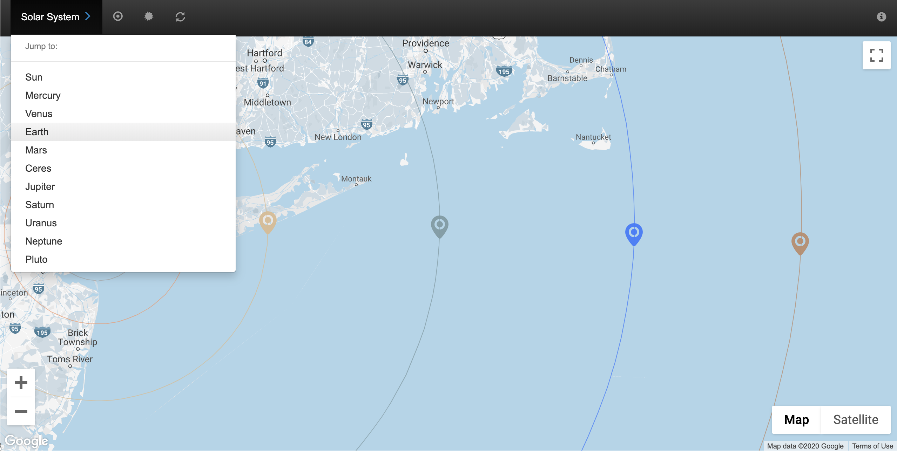
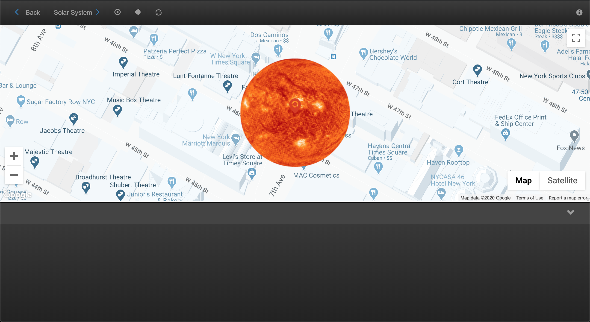

## Scale of Things

This is a javascript mini-app I built overnight during the summer of 2015 after the
first image of dwarf planet Pluto emerged from the [New Horizons](https://en.wikipedia.org/wiki/New_Horizons)
spacecraft flyby, the first to reach Pluto.

I felt inspired to build something that could demonstrate the vast scale of the solar system by overlaying it
over one's familiar map, choosing a scale size, and observing planet sizes and their orbits as that scale.
At the time it was built using ES5, older versions of bootstrap, gulp, jade, and a bunch of other nonsense
that has been deprecated over the years. As I tried porting it from bitbucket to gh, none of it
compiled anymore. I ended up just stripping it down to only the front-end resources and dumping the rest.

### Screenshots

Below are some screenshots that showcase its functionality.

